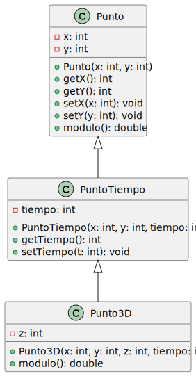

## Ejercicio de Encapsulamiento, herencia y polimorfismo - 2

.

## Diagrama de clases

<!--
https://gist.github.com/noamtamim/f11982b28602bd7e604c233fbe9d910f
Usar para generar con plantuml:
plantuml -tsvg README.md
-->

<!-->
```
@startuml diagrama-clases
class Punto {
  - x: int
  - y: int
  + Punto(x: int, y: int)
  + getX(): int
  + getY(): int
  + setX(x: int): void
  + setY(y: int): void
  + modulo(): double
}

class PuntoTiempo {
  - tiempo: int
  + PuntoTiempo(x: int, y: int, tiempo: int)
  + getTiempo(): int
  + setTiempo(t: int): void
}

class Punto3D {
  - z: int
  + Punto3D(x: int, y: int, z: int, tiempo: int)
  + modulo(): double
}

Punto <|-- PuntoTiempo
PuntoTiempo <|-- Punto3D
@enduml
```
-->



- `src`: the folder to maintain sources
- `lib`: the folder to maintain dependencies

Meanwhile, the compiled output files will be generated in the `bin` folder by default.

> If you want to customize the folder structure, open `.vscode/settings.json` and update the related settings there.

## Dependency Management

The `JAVA PROJECTS` view allows you to manage your dependencies. More details can be found [here](https://github.com/microsoft/vscode-java-dependency#manage-dependencies).
