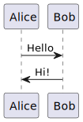

## Ejercicio de Encapsulamiento, herencia y polimorfismo - 2

.

## Diagrama de clases

<!--
Usar para generar con plantuml:
plantuml -tsvg README.md
-->

<!--
<div hidden>
```
@startuml firstDiagram

Alice -> Bob: Hello
Bob -> Alice: Hi!
		
@enduml
```
</div>
-->



- `src`: the folder to maintain sources
- `lib`: the folder to maintain dependencies

Meanwhile, the compiled output files will be generated in the `bin` folder by default.

> If you want to customize the folder structure, open `.vscode/settings.json` and update the related settings there.

## Dependency Management

The `JAVA PROJECTS` view allows you to manage your dependencies. More details can be found [here](https://github.com/microsoft/vscode-java-dependency#manage-dependencies).
